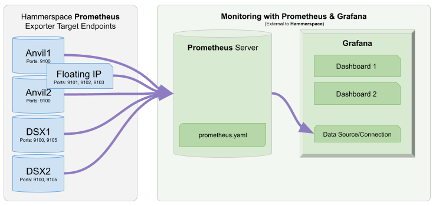

# Hammerspace Monitoring & Alerting with Prometheus and Grafana 

A guide for the set up of Prometheus server and Grafana dashboards for Hammerspace Data Platform. Leveraging on-system Prometheus exporters, this solution will provide a robust solution to monitor your data storage software and systems.

## Overview

The Hammerspace Prometheus and Grafana monitoring system architecture is as follows:

The diagram shows the architecture of Prometheus server pulling data from each of the exporters on the nodes (there can be configurations with many more nodes). Those metrics are then stored in the Prometheus timeseries database. Last it shows Grafana querying the Prometheus DB and generating the dashboards and graphs.

This Github repo will walk through the configuration of the right side, green block of the diagram above. It assumes you do not currently have your own monotoring timeseries database (TSDB) running. Our example will walk through a simple configuration with one "server"/machine/VM/docker configuration.

## Requirements

- Hammerspace cluster (running and accessible)
- Valid Hammerspace credentials
- Network access to Hammerspace cluster on ports 9100-9105
- System(s) to run Prometheus and Grafana or Docker and docker-compose
- Python 3.6+ with `requests` and `PyYAML` modules

## 1. Set up your system and install Prometheus Server and Grafana

You can install Prometheus and Grafana on Windows, Linux, MacOSX, or via Docker.

1. Install Prometheus (Server/DB) - https://prometheus.io/docs/prometheus/latest/installation/
2. Install Grafana - https://grafana.com/docs/grafana/latest/setup-grafana/installation/

## 2. Enable Prometheus Exporters on Hammerspace

1. Log in to your Hammerspace (Anvil) system via ssh using your admin credentials
2. Run `cluster-config --prometheus-exporters-enable`

## 3. Create and configure initial configuration file

1. On your Prometheus/Grafana server, run `python installers/config.py --create-config-ini`
2. Edit the file `installers/config_tooling.ini` and put in your Hammerspace clusters.
3. Add your Grafana Service Account Token.
   1. http://localhost:3000/org/serviceaccounts
   2. Click "Add Service Account"
   3. Name is something like hammerspace-prometheus.
   4. Click Role "Admin" and then click "Create" button.
   5. Click "Add service account token" button.
   6. Click "Generate Token" button.
   7. Copy the token.
   8. Paste the token in config_tooling.ini file.

## 4. Configure Prometheus server/database

1. run `python installers/config.py --prometheus`
2. Copy the generated prometheus.yml file to your prometheus server (usually /etc/prometheus/prometheus.yml)
3. Restart Prometheus server
4. Wait approximately 60 seconds.
5. Check Prometheus data status:
   - `curl 'http://localhost:9090/api/v1/query?query=count(up==1)'` - Look for a timestamp and a number of "up" endpoints of at least 5. 
   - `curl -X POST 'http://localhost:9090/api/v1/query'  -d 'query=count({__name__=~"hammerspace.*"})'` - Look for a number in the hundreds within a few minutes.

## 5. Install Grafana data source and dashboards

python installers/config.py --grafana

